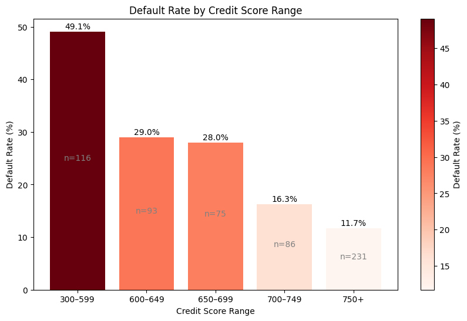
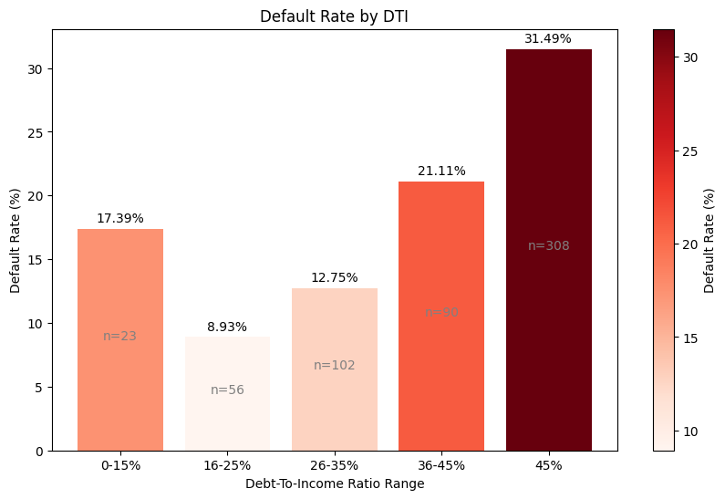
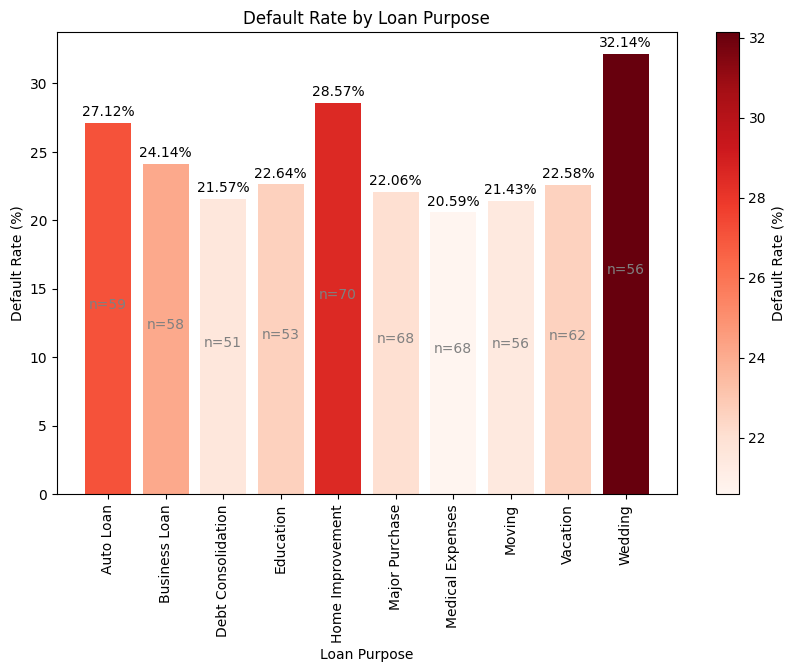
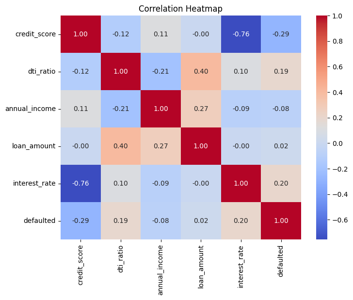

# Loan Default Risk Analysis

This project analyzes borrower profiles and loan application data to identify key drivers of loan defaults, quantify risk patterns, and recommend actionable changes to improve underwriting decisions.

## About

Horizon Financial Group has issued over 600 personal loans across 2024 and 2025. The company has noticed that roughly 1 in 4 loans are defaulting, which is well above their target of 12%. 

The VP of Risk has asked your team to analyze the existing loan book and borrower data to answer key questions about what is driving defaults. Your analysis will directly inform changes to their credit scoring model and loan approval thresholds. 

## How to Run

This notebook was developed in Google Colab using Google Drive paths.

To run this notebook:

1. Upload the dataset files from the `data/` folder into your environment
2. Update file paths in the notebook to match your setup
3. Remove or skip the Google Drive mounting cells if not needed

Note: The notebook includes all outputs and visualizations, so it can be reviewed without re-running the code.

## Workflow

1. **Data Preparation**
    - Loaded and explored both datasets
    - Checked for missing values, data types, and summary statistics
    - Merged datasets using `borrower_id`
2. **Segment Analysis**
    - Created credit score buckets and computed default rates
    - Analyzed default rates across DTI ranges, employment status, and loan purposes
3. **Correlation Analysis**
    - Identified which numeric variables (credit score, DTI, income, loan amount, interest rate) have the strongest correlation with defaults
    - Evaluated relationships between numerical variables and default status
    - Used Pearson correlation and point-biserial correlation
4. **Visualization**
    - Default rates by credit score range
    - Default rates by DTI buckets
    - DTI vs. default scatter plot
    - Loan purposes vs default comparison
    - Comparing loan counts based on loan purpose, default and non-default loans unstacked
    - Correlation Heatmap of Numerical Variables Contributing to Default Risk
5. **Additional Analysis**
    - Examined relationship between employment duration and default rates
    - Compared average loan amounts across default vs non-default categories

## Key Insights

### 1. Credit Score is one of the most significant risk indicators
- Overall default rate: **24.29% (n = 601)**
- Borrowers with credit scores **300-599 show the highest default rate of 49.14%**
- This indicates a sharp risk concentration in low credit segments.

### 2. DTI Ratio shows a clear risk threshold
- Default rates increase significantly beyond **45% DTI**
- 45% is a critical underwriting cutoff

### 3. Loan Purpose influences risk patterns
- Highest defaults observed in:
  - Wedding
  - Home improvement
  - Auto loans
- A nuanced pattern emerges when combining loan purpose with loan amount:
  - Average loan amount differs significantly between defaulted and non-defaulted loans in select categories of loan purpose
  - Higher loan amounts are associated with increased defaults in education, medical, and debt consolidation categories
  - Lower loan amounts show higher defaults in discretionary categories such as major purchases, business loans, and home improvement
  - This suggests that both **loan purpose and loan size interact to influence default risk**, rather than acting independently.
  
  

### 4. Employment factors show weaker predictive power
- Minimal variation across employment types
- Slightly higher risk for <2 years employment (34.52%)
- Employment alone is not a strong standalone risk indicator.

### 5. Higher interest rates show a strong positive correlation with default risk
- This likely reflects underlying borrower risk already being priced into loan terms

### 6. Correlation Heatmap
- Credit score shows a negative correlation with default (-0.29)
- Interest rate shows a positive correlation with default (0.20)
- DTI ratio has a weaker but noticeable positive relationship (0.19)
- - Overall, default risk appears to be driven by a combination of borrower creditworthiness (credit score, DTI) and loan structuring factors (loan purpose, loan size, interest rate), indicating that a multi-factor risk assessment approach is essential.

## Recommendations

### 1. Strengthen Credit Score Thresholds
- Minimum recommended credit score: **700**
- Applications below this threshold should require:
  - Additional verification
  - Higher collateral
  - Risk-adjusted interest rates

### 2. Enforce DTI-Based Risk Controls
- Maximum DTI threshold: **45%**
- Applications above this level should trigger:
  - Stricter approval criteria
  - Reduced loan exposure

### 3. Apply Purpose-Based Risk Adjustments
- High-risk categories (wedding, home improvement, auto loans) should require stricter approval criteria
- For education, medical expenses, and debt consolidation loans: large loan amounts should be subjected to tighter scrutiny and risk mitigation measures should be placed

### 4. Monitor High Interest Rate Loans as Risk Signals
- Implement enhanced monitoring for high-interest loans
- Introduce early warning systems for potential delinquency
- Combine interest rate signals with other risk indicators for proactive intervention

## Acknowledgements

This project was developed as part of my learning in data analysis. The datasets and problem context are based on guided case study resources, while all analysis and implementation are my own.

## License

This project is licensed under the MIT License.
